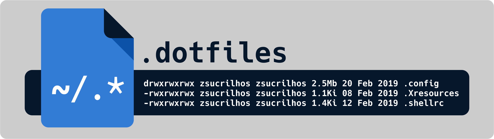

# My Openbox dotfiles
kumpulan dotfiles hasil curi dari mana saja

## Detail

<table>
   <tr>
     <th>Item</th>
     <th>Value</th>
  </tr>
  <tr>
    <td>Fav WM(s)</td>
    <td>Oepnbox, i3, bspwm, 2bwm</td>
   </tr>
   <tr>
    <td>Shell</td>
    <td>Zsh</td>
   </tr>
   <tr>
    <td>DM</td>
    <td>Lightdm</td>
   </tr>
   <tr>
    <td>Font</td>
    <td>Roboto</td>
   </tr>
   <tr>
    <td>Terminal</td>
    <td>Termite, urxvt</td>
   </tr>
   <tr>
    <td>Launcher</td>
    <td>dmenu, rofi</td>
   </tr>
   <tr>
    <td>Bar</td>
    <td>Polybar, lemonbar</td>
   </tr>
   <tr>
    <td>Compositor</td>
    <td>compton</td>
   </tr>
   <tr>
    <td>Image Viewer</td>
    <td>viewnoir, feh</td>
   </tr>
   <tr>
    <td>Music player</td>
    <td>ncmpcpp with mpd</td>
   </tr>
   <tr>
    <td>Text editor</td>
    <td>nvim, geany, atom</td>
   </tr>
</table>
   
## preview

